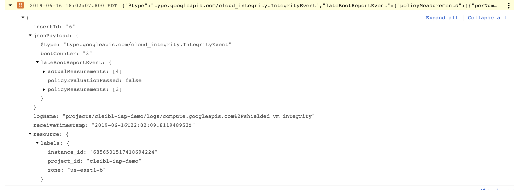

# Terraform - Event Driven Security Demonstration

The Terraform module is used to demonstrate the concepts discussed in [Article](https://medium.com/p/4f49af8eb245/edit)

## Prerequisites 

* A Stackdriver Workspace
* A Google Cloud Project monitored by the above Stackdriver Workspace
* [Terraform v0.12](https://learn.hashicorp.com/terraform/getting-started/install.html)
* [gcloud sdk](https://cloud.google.com/sdk/install)

The user running terraform must have the following permissions:
* Compute Admin
* Logging Administrator
* 

## Usage

1. Clone Repository Locally
```
git clone https://github.com/ScaleSec/Shielded-VM-Demo
```
2. Change Directory
```
cd Shielded-VM-Demo
```
3. Create an terraform.auto.tfvars file - Replace values before running command
```
cat > terraform.auto.tfvars <<EOF
  project_id                   = "<<replace with your project id>>"
  notification_email_address   = "<<replace with your email>>"
  stackdriver_project          = "<<replace with your Stackdriver Workspace project ID>>
  ssh_cidr_range               = "<<replace with the public IP address of your machine>>"
EOF
```

4. Authenticate to Google Cloud using Application Default Credentials
```
gcloud auth application-default login
```

5. Run Terraform

```
terraform init
terraform plan
terraform apply
```

6. SSH into the Shielded VM instance

```
gcloud compute ssh $(terraform output shielded_vm_instance_name)
```

7. Install Extra Kernel Drivers

Instead of installing a rootkit, we'll install extra kernel drivers. By doing so, we've changed the boot sequence and the measurement hashes. Loading these extra drivers will change the cryptographic hash created by the vTPM. Shielded VM's integrity monitoring feature will notice and log this violation in stackdriver.

```
sudo apt-get update && sudo apt-get upgrade
sudo apt install nvidia-driver-390
sudo reboot
```
___Note: You will be prompted to provide a password, provide the password, but we will not use it. The purpose of this password is out of scope for this demo.__

8. Recieve Stackdriver Alert

When the virtual machine boots up, the Integrity Monitoring feature of Shielded VM notices the hash values of the boot components are not equal and logs this violation to stackdriver.

The stackdriver log is shown below, notice a few things about this log
* jsonPayload.lateBootReportEvent.policyEvaluationPass = false
* If you expanded the log and compare the actual hash value to the policy hash value measurements. These values would not be equal, resulting in the integrity failure.

You should see a similar log within your projects stackdriver logging



Within a few minutes, you should see the alert appear within the Stackdriver Workspace UI


## Inputs

| Name | Description | Type | Default | Required |
|------|-------------|:----:|:-----:|:-----:|
| project_id |The ID of the project where the pub/sub topic will be installed  | string | - | yes |
| notification_email_address | The Email Address which should recieve notifications for Shielded VM Failures | string | - | yes |
| stackdriver_project | The Project ID of the Stackdriver Workspace which to deploy the Stackdriver Alerts | string | - | yes |
| ssh_cidr_range | The CIDR block to allow SSH access to the Shielded VM instance | string | - |  yes |
| region | The Region to deploy resources into| string |`us-east1` | no |
| shielded_vm_image | The VM Image to deploy.  Image must be compatible with shielded VM| string |`gce-uefi-images/ubuntu-1804-lts` | no |
| subnet_cidr_range | The IPV4 Range for the Network  | string  | `"192.168.1.0/24"`| no | 
| zone  | The Zone which to deploy the VM into.  Zone must be within the selected region | string  | `us-east1-b` | no |
| enable_secure_boot | Enables Secure Boot feature in Shielded VM | boolean | true | no |
| enable_vtpm | Enable Virtual TPM feature in Shielded VM | boolean | true | no |
| enable_integrity_monitoring | Enable Integrity Monitoring feature in Shielded VM | boolean | true | no |


## Outputs

| Name | Description |
|------|-------------|
| shielded_vm_instance_name    | The name of the Shielded VM instance |


#FAQ

Problem: I recieve the following Error Message

```
NotificationChannel: googleapi: Error 400: 'projects/{{your-project-name}}' is not a Stackdriver workspace.
```

Solution: 

The project you put in the `stackdriver_project` variable is not a stackdriver workspace